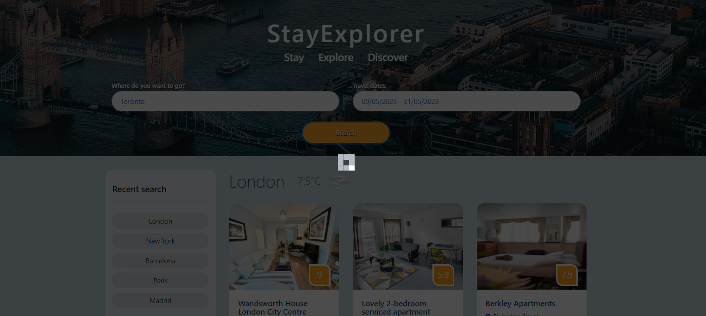
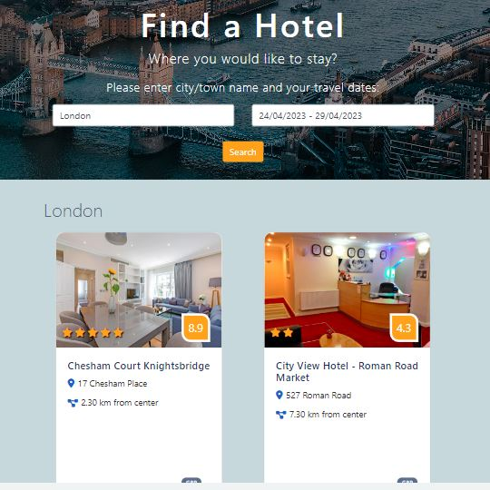
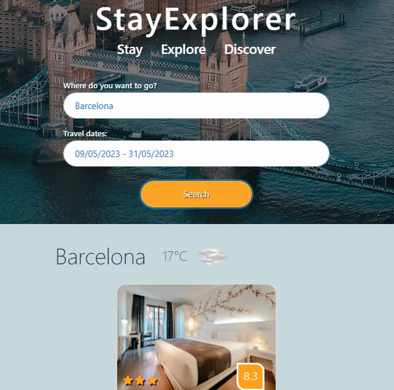

# Find a hotel app - group project

## Description

We have created a "Find a hotel" app single page app. When a user wants to travel anywhere in the world, they can use this app to find out what hotels are available in the area.
  
The landing page shows default city London and available hotels, with default dates - starting today +5 days: 

When user enters their desired destination city and travel dates, clicks search button, the hotels are displayed in desired destination: 

While data is retrieved from database, the spinner is displayed:

Recent searches are saved to the left side panel, in clickable buttons.  User can press the button and retrieve the information about hotels again.

Single page app is responsive. on the smaller screens fewer hotels are displayed in one line and recent search is moved down.
Two hotel cards on tablet screen: 

One hotel card on mobile screen:

## Languages/libraries/API's used

- Javascript
- jQuery
- [Booking API](https://rapidapi.com/apidojo/api/booking)
- [GeoDB Cities API](https://rapidapi.com/wirefreethought/api/geodb-cities) 
- JavaScript [date range picker](https://www.daterangepicker.com/#:~:text=Originally%20created%20for%20reports%20at,like%20%22Last%2030%20Days%22.)
- Bootstrap
- HTML
- CSS
  
## Installation

There is no installation needed, please view deployed app [here](https://astarem.github.io/travel-app/)

## Usage

Please enter city/town name and choose travel dates, as shown in description section. 

