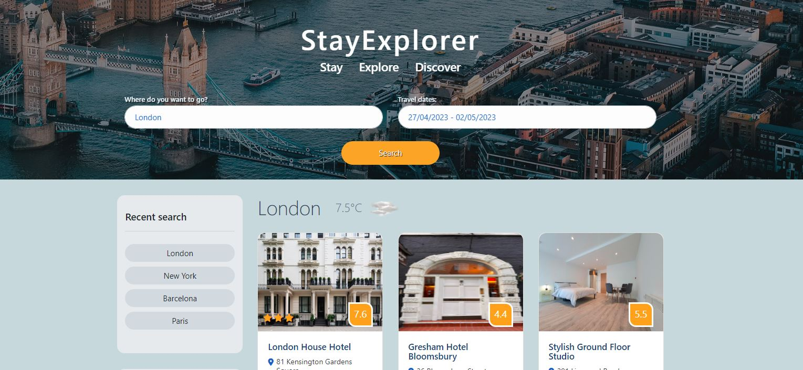
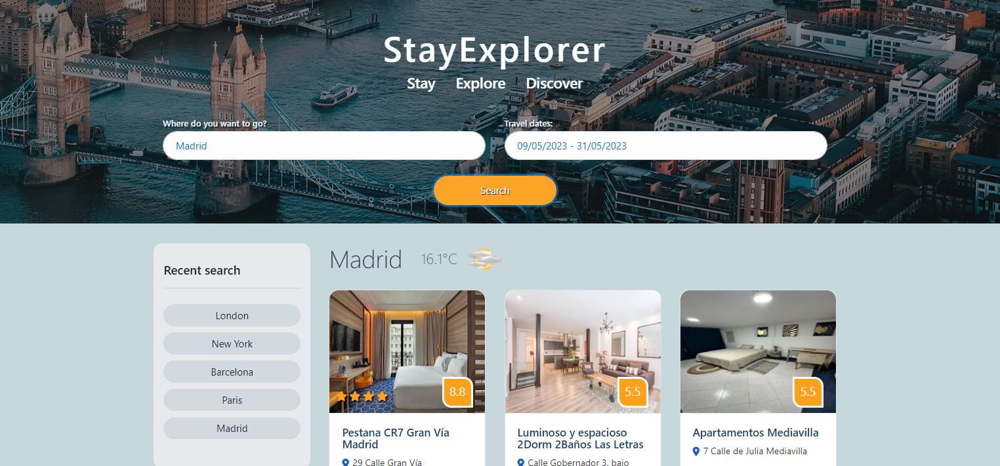

# Find a hotel app
Group project

## Description

This is a group project.
We have created a "Find a hotel" app. 

API's used for this project: 
- [Booking api](https://rapidapi.com/apidojo/api/booking)
- [GeoDB Cities](https://rapidapi.com/wirefreethought/api/geodb-cities)
  
The landing page shows default city London and default dates +5 from today:

User needs to enter his desired destination city and travel dates, click search button and the hotels are displayed in desired destination: 

While data is retrieved from database, the spinner is displayed.

Recent searches are saved to the side panel, in clickable buttons.  User can press the button and retrieve the information about hotels again.

## Installation

There is no installation needed, please view deployed app [here](https://astarem.github.io/travel-app/)

## Usage

Please enter city/town name and choose travel dates, as shown in description section. 

